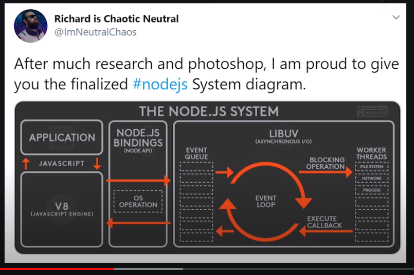

## 공식 문서 node js 란?
https://nodejs.org/en/about/

## node js 공부 및 자료 정리
[1] Frontend Masters [Introduction to Node js 강의 주소](https://frontendmasters.com/courses/node-js/) / [강의 repo](https://github.com/FrontendMasters/intro-node-js)

- 공부 내용 정리: [to my contents](./1_introToNodeJs)

- 강의에서 포크해 와서 내가 사용한 리포: [here](https://github.com/hayoung0Lee/intro-node-js)

- 강의 후기: node js 전반에 대한 이해를 할 수 있어서 좋았다. 또한 엄청 잘하는 사람이 자바스크립트 환경에 대해서 어떻게 이해하고있는지를 배울 수 있어서 만족스러웠다. 

[2] Frontend Masters [The Hard Parts of Servers & Node.js]https://frontendmasters.com/courses/servers-node-js/ 

- 공부 내용 정리: [to my contents](./2_theHardParts)

